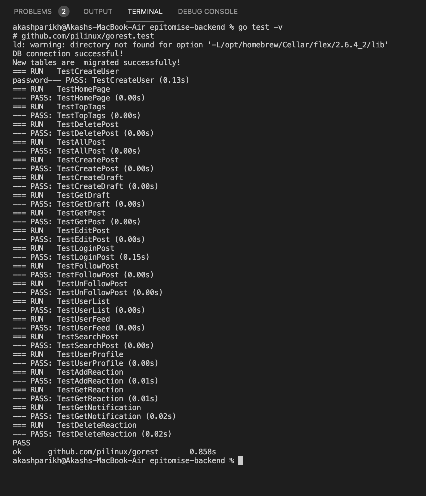
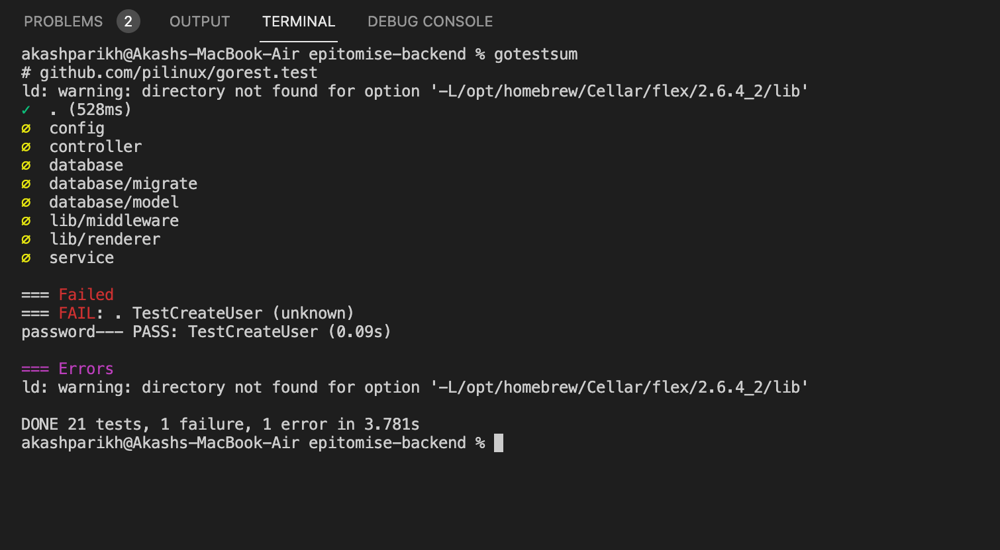
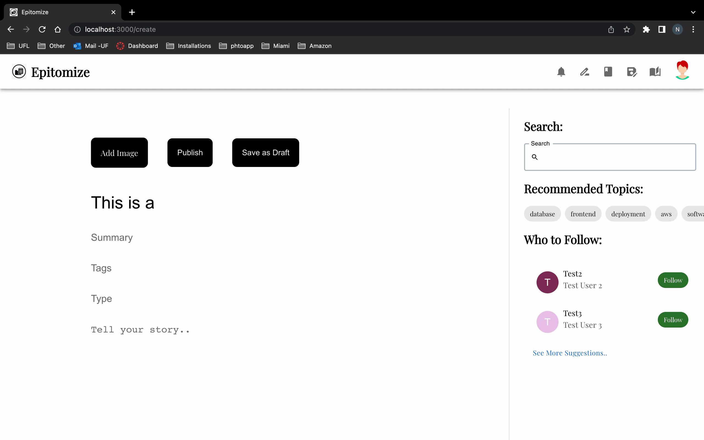
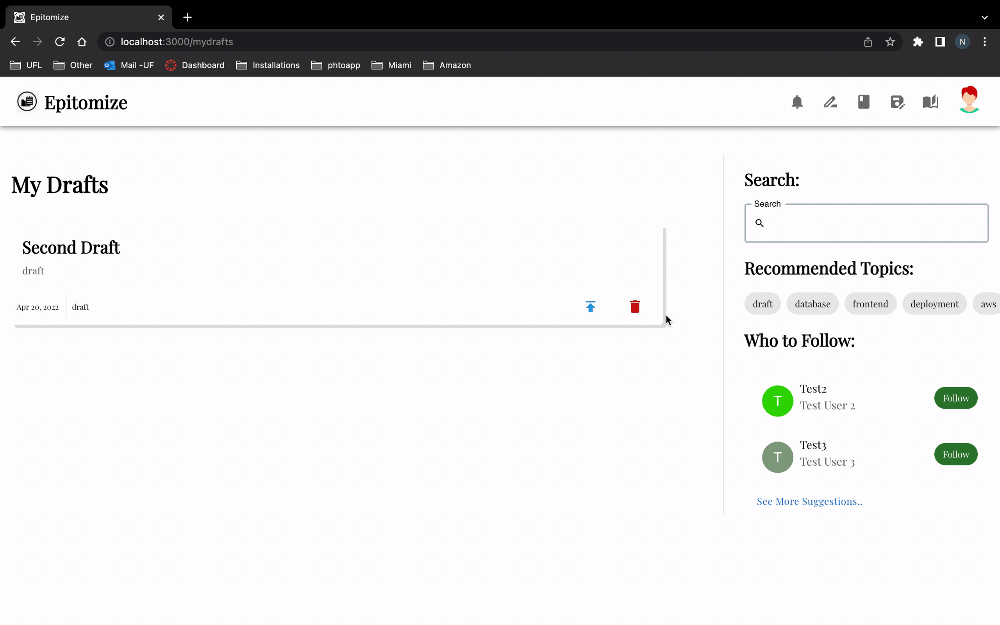
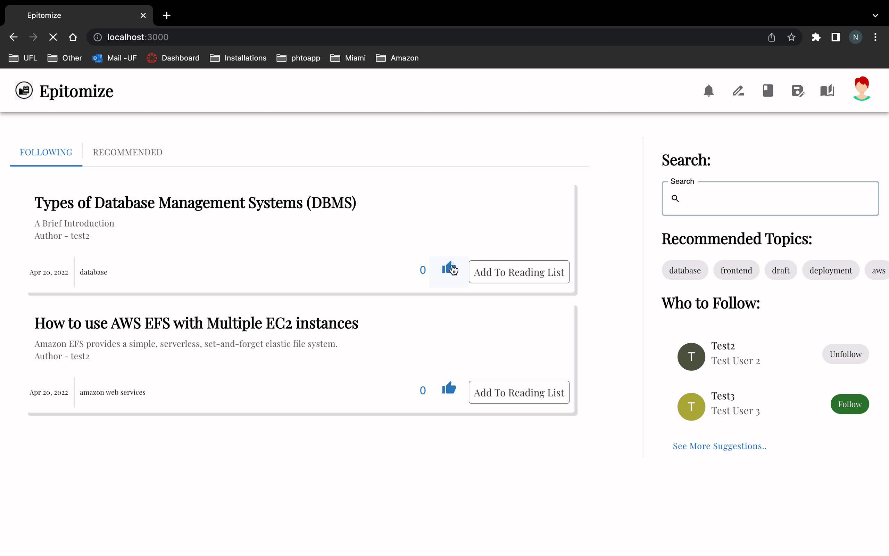
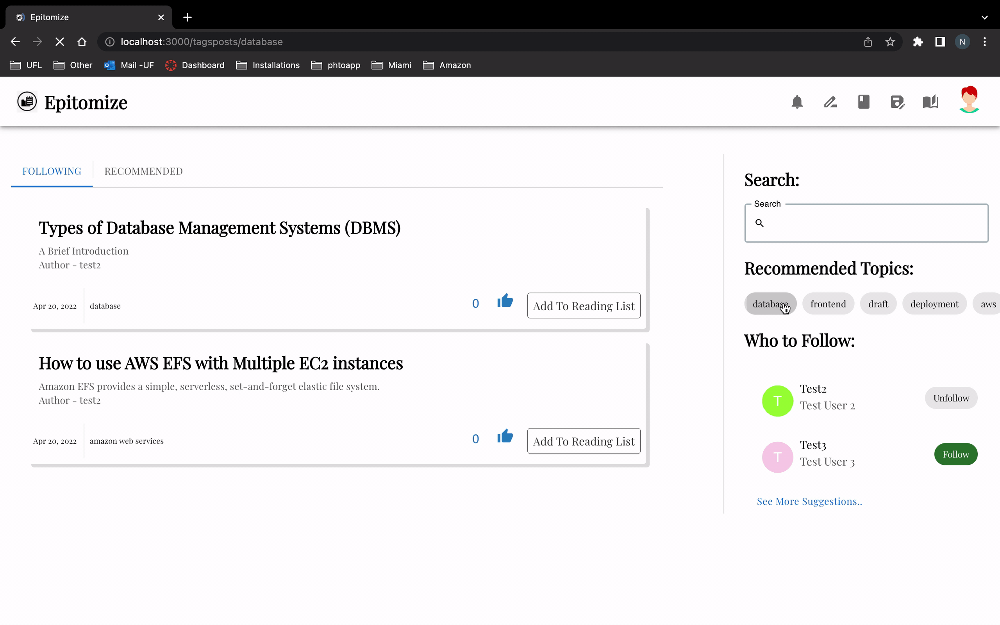
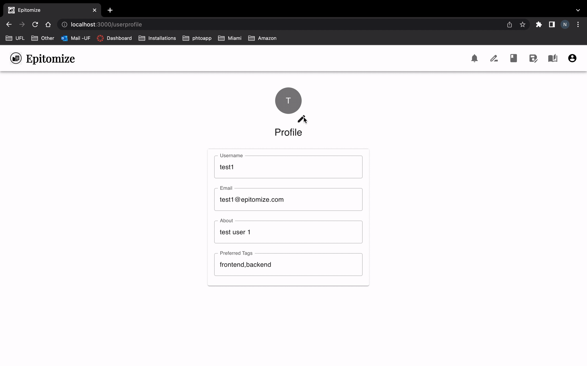
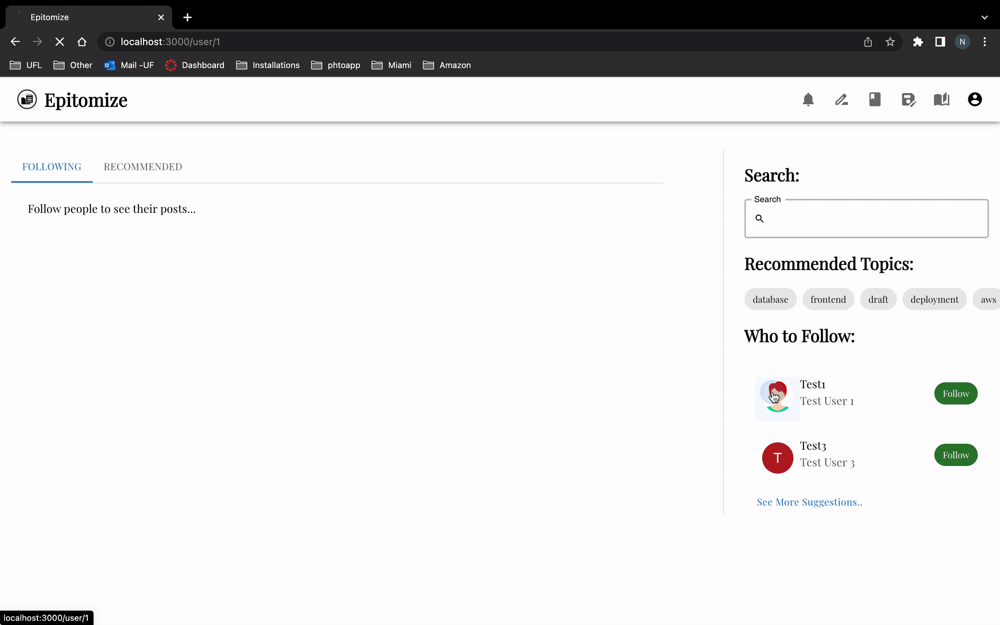
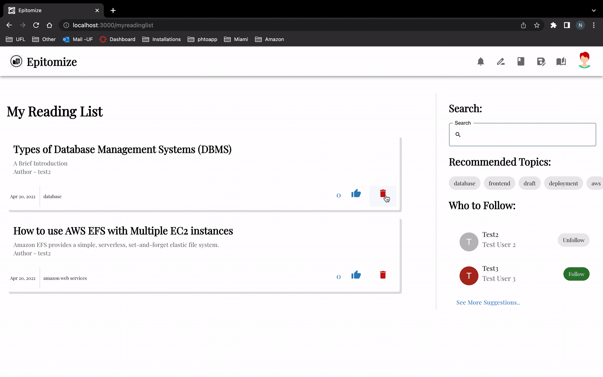

# Sprint 4

In Sprint 4 the following user stories were successfully implemented:

1. As a user, I should be able to view another users profile.
-   In this user story, the user has the ability to view another users profile.
2. As a user I should be able to add images for my posts.
-   In this user story, the user has the ability to add images to their post.
3. As a user, I should be able to add a profile picture.
-  In this user story, user can add his profile picture to his profile.
4. As a user, I should be able to view all posts with a tag.
-  In this user story, the user has the ability to select a tag and all the post related to that tag is displayed.
5. As a user, I should be able to create a draft of a post.
-  In this user story, the user has the ability to create a draft version of it's post.
6. As a user, I should be able to convert a draft to a post.
-  In this user story, the user has the ability to publish the draft created by the user.
7. As a user, I should be able to delete a draft. 
-  In this user story, the user has the ability to delete the draft created by the user.
8. As a user, I should be able to react to another users post.
-  In this user story, the user has the ability to add reaction for example like other user's post.
9. As a user, I should be able to add posts to my reading list.
-  In this user story, the user has the ability to add selected post to my reading list.
10. As a user, I should be able to receive notifications for reactions on my posts.
-  In this user story, the user has the ability to get all the notifications related to reactions of his post.
11. As a user, I should be able to view image of the posts.
-  In this user story, the user has the ability to view the images added to his post.
12. As a user, I should be able to view the list of my drafts.
-  In this user story, the user has the ability to view the list of the drafts created by the user.
13. As a user, I should be able to delete my notifications.
-  In this user story, the user has the ability to remove any of the notifications required.
14. As a user, I should be able to mark my notifications as read.
-  In this user story, the user has the ability to read the given notifications and mark it as read.
15. As a user, I should be able to mark all my unread notifications as read. 
-  In this user story, the user has the ability to mark all unread notifications as read.
16. As a user, I should be able to get my reading list.
-  In this user story, the user has the ability to receive all the post added to his reading list
17. As a user, I should be able to delete a post from my reading list.
-  In this user story, the user has the ability to delete any post from his reading list.
18. As a user, I should be able to see the number of likes on a post. 
-  In this user story, the user has the ability to see number of likes under each post.
19. As a user, I should be able to unlike a post.
-  In this user story, the user has the ability to unlike any post.
20. As a user, I should be able to view the author of a post.
-  In this user story, the user has the ability to view author name for each post.
21. As a user, I should be able to edit/add image to post later. 
-  In this user story, the user has the ability to upload a new image or edit image to my posts.

## Backend:

#### 1. Upload Image API

This API is used for upload images for user profile picture.

```
POST  /uploadImage
```
##### Header:

    Authorization: Access token
#####  Example Request Body:

```
myfile = abc.png
```

##### Example Responses:

```
{
    "message": "Successfully Uploaded File"
}
```

##### Status Codes:

-   **200**: Status OK
-   **400**: Bad Request
-   **500**: Internal Server Error
-   **503**: Service Unavailable

#### 2. Get Uploaded Image API

This API is used to get user's profile picture.

```
GET  /uploadImage
```
##### Header:

    Authorization: Access token
##### Example Responses:

```
{
    "Image_path": "{username}/{imagename}"
}
```

##### Status Codes:

-   **200**: Status OK
-   **400**: Bad Request
-   **500**: Internal Server Error
-   **503**: Service Unavailable

#### 3. Get Single Draft  API

This API is used to get user's created single draft.

```
GET  /draft/{post_id}
```
##### Header:

    Authorization: Access token
##### Example Responses:

```
{
"PostsUId": 6,
"Type": "Movie",
"Title": "New Movie",
"Summary": "test",
"Content": "test",
"Linked_Post": 0,
"Status": "1",
"ReactionCount": 3,
"CreatedAt": "2022-04-13T20:11:07.945939-04:00",
"UpdatedAt": "2022-04-13T20:11:07.945939-04:00",
"Image": "",
"TagList": [
"Sad",
"Happy"
],
"Tags": "Sad,Happy"
}
```

##### Status Codes:

-   **200**: Status OK
-   **400**: Bad Request
-   **500**: Internal Server Error
-   **503**: Service Unavailable

#### 4. Get All Draft API

This API is used to get all drafts created by the user

```
GET  /draft
```
##### Header:

    Authorization: Access token

##### Example Responses:

```
{
    "Posts": [
{
"PostsUId": 6,
"Type": "Movie",
"Title": "New Movie",
"Summary": "test",
"Content": "test",
"Linked_Post": 0,
"Status": "1",
"ReactionCount": 3,
"CreatedAt": "2022-04-13T20:11:07.945939-04:00",
"UpdatedAt": "2022-04-13T20:11:07.945939-04:00",
"Image": "",
"TagList": [
"Sad",
"Happy"
],
"Tags": "Sad,Happy"
},
        {
"PostsUId": 5,
"Type": "Book",
"Title": "New Book",
"Summary": "test",
"Content": "test",
"Linked_Post": 0,
"Status": "1",
"ReactionCount": 3,
"CreatedAt": "2022-04-13T20:11:07.945939-04:00",
"UpdatedAt": "2022-04-13T20:11:07.945939-04:00",
"Image": "",
"TagList": [
"Sad",
"Happy"
],
"Tags": "Sad,Happy"
}
}
```

##### Status Codes:

-   **200**: Status OK
-   **400**: Bad Request
-   **500**: Internal Server Error
-   **503**: Service Unavailable


#### 5. Convert Draft to Post API

This API is used to change post status from draft to post.

```
POST  /toPost/{post_id}
```
##### Header:

    Authorization: Access token

##### Example Responses:

```
{
"message" : "Draft convereted to Post"
}
```

##### Status Codes:

-   **200**: Status OK
-   **400**: Bad Request
-   **500**: Internal Server Error
-   **503**: Service Unavailable

#### 6. Get All Notifications API

This API is used to get all the notifications related to the user.

```
GET  /notification
```
##### Header:

    Authorization: Access token


##### Example Responses:

```
{
"AllNotifications": [
	{
		"NId": 8,
		"Userid": 1,
		"Message": "User {username} like your post {posttitle}",
		"Path": "/post/1",
		"CreatedAt": "2022-04-18T16:06:25.470515-04:00",
	"Read": 0
	}
  ]
}
```

##### Status Codes:

-   **200**: Status OK
-   **400**: Bad Request
-   **500**: Internal Server Error
-   **503**: Service Unavailable

#### 7. Delete Notifications API

This API is used to delete a specific notification.

```
DELETE  /notification/{notificationid}
```
##### Header:

    Authorization: Access token


##### Example Responses:

```
{
"message" : "Notification Successfuly deleted"
}
```

##### Status Codes:

-   **200**: Status OK
-   **400**: Bad Request
-   **500**: Internal Server Error
-   **503**: Service Unavailable

#### 8. Read a Single Notifications API

This API is used to change read status of given notification.

```
GET  /notification/{notificationid}
```
##### Header:

    Authorization: Access token


##### Example Responses:

```
{
"message" : "Notification Successfuly read"
}
```

##### Status Codes:

-   **200**: Status OK
-   **400**: Bad Request
-   **500**: Internal Server Error
-   **503**: Service Unavailable

#### 9. Read a All Notifications API

This API is used to change read status of given notification.

```
GET  /allnotification
```
##### Header:

    Authorization: Access token


##### Example Responses:

```
{
"message" : "All Notification Successfuly read"
}
```

##### Status Codes:

-   **200**: Status OK
-   **400**: Bad Request
-   **500**: Internal Server Error
-   **503**: Service Unavailable


#### 10. GET Posts for a Tag API
This API gets all posts that have the given tag

    GET  /post/tag/{tag_name}

##### Header:

    Authorization: Access token


#### Example Responses:

    [
        {
            "PostsUId": 1,
            "Type": "Blockchain",
            "Title": "Trade on Margin with 0% Interest",
            "Summary": "Get up to 5x leverage with 0% interest ",
            "Content": "Last year we launched Margin Trading on the Blockchain.com Exchange, giving users in over 150 supported countries the ability to trade with up to 5x leverage.",
            "Linked_Post": 0,
            "Status": "Post",
	    "ReactionCount": 3,
            "CreatedAt": "2022-04-01T13:32:05.330474-04:00",
            "UpdatedAt": "2022-04-01T13:32:05.330474-04:00",
            "TagList": null,
            "Tags": "Crypto,Bitcoin,Life"
        },
        {
            "PostsUId": 2,
            "Type": "Cricket",
            "Title": "Cricket 123",
            "Summary": "Get up to 5x leverage with 0% interest ",
            "Content": "Last year we launched Margin Trading on the Blockchain.com Exchange, giving users in over 150 supported countries the ability to trade with up to 5x leverage.",
            "Linked_Post": 0,
            "Status": "Post",
	    "ReactionCount": 3,
            "CreatedAt": "2022-04-01T13:32:37.540434-04:00",
            "UpdatedAt": "2022-04-01T13:32:37.540434-04:00",
            "TagList": null,
            "Tags": "Cricket, Life"
        },
        {
            "PostsUId": 3,
            "Type": "Football",
            "Title": "Football 123",
            "Summary": "Get up to 5x leverage with 0% interest ",
            "Content": "Last year we launched Margin Trading on the Blockchain.com Exchange, giving users in over 150 supported countries the ability to trade with up to 5x leverage.",
            "Linked_Post": 0,
            "Status": "Post",
	    "ReactionCount": 3,
            "CreatedAt": "2022-04-01T13:32:56.863487-04:00",
            "UpdatedAt": "2022-04-01T13:32:56.863487-04:00",
            "TagList": null,
            "Tags": "Football, Life"
        }
    ]


#### Status Codes:

-   **200**: Status OK
-   **400**: Bad Request
-   **500**: Internal Server Error
-   **503**: Service Unavailable


#### 11. GET Other User Profile API
This API gets the profile details of a registered User

    GET  /user/profile/{user_id}

##### Header:

    Authorization: Access token


#### Example Responses:

    {
        "Username": "user",
        "About": "About user",
	"Profile Picture": "{image_path}"
    }


#### Status Codes:

-   **200**: Status OK
-   **400**: Bad Request
-   **500**: Internal Server Error
-   **503**: Service Unavailable


#### 12. Add Post to reading list API

This API is used to add a post to the current users reading list.

```
POST  /readinglist/{post_id}
```
##### Header:

    Authorization: Access token

##### Example Responses:

```
{
"message" : "Post added to reading list"
}
```

##### Status Codes:

-   **200**: Status OK
-   **400**: Bad Request
-   **500**: Internal Server Error
-   **503**: Service Unavailable


#### 13. GET reading list of current user API
This API gets all posts that the current user has added to their reading list

    GET  /readinglist

##### Header:

    Authorization: Access token


#### Example Responses:

    [
        {
            "PostsUId": 1,
            "Type": "Blockchain",
            "Title": "Trade on Margin with 0% Interest",
            "Summary": "Get up to 5x leverage with 0% interest ",
            "Content": "Last year we launched Margin Trading on the Blockchain.com Exchange, giving users in over 150 supported countries the ability to trade with up to 5x leverage.",
            "Linked_Post": 0,
            "Status": "Post",
	    "ReactionCount": 3,
            "CreatedAt": "2022-04-01T13:32:05.330474-04:00",
            "UpdatedAt": "2022-04-01T13:32:05.330474-04:00",
            "TagList": null,
            "Tags": "Crypto,Bitcoin,Life"
        },
        {
            "PostsUId": 2,
            "Type": "Cricket",
            "Title": "Cricket 123",
            "Summary": "Get up to 5x leverage with 0% interest ",
            "Content": "Last year we launched Margin Trading on the Blockchain.com Exchange, giving users in over 150 supported countries the ability to trade with up to 5x leverage.",
            "Linked_Post": 0,
            "Status": "Post",
	    "ReactionCount": 3,
            "CreatedAt": "2022-04-01T13:32:37.540434-04:00",
            "UpdatedAt": "2022-04-01T13:32:37.540434-04:00",
            "TagList": null,
            "Tags": "Cricket, Life"
        },
        {
            "PostsUId": 3,
            "Type": "Football",
            "Title": "Football 123",
            "Summary": "Get up to 5x leverage with 0% interest ",
            "Content": "Last year we launched Margin Trading on the Blockchain.com Exchange, giving users in over 150 supported countries the ability to trade with up to 5x leverage.",
            "Linked_Post": 0,
            "Status": "Post",
	    "ReactionCount": 3,
            "CreatedAt": "2022-04-01T13:32:56.863487-04:00",
            "UpdatedAt": "2022-04-01T13:32:56.863487-04:00",
            "TagList": null,
            "Tags": "Football, Life"
        }
    ]


#### Status Codes:

-   **200**: Status OK
-   **400**: Bad Request
-   **500**: Internal Server Error
-   **503**: Service Unavailable


#### 14. Remove Post from reading list API

This API is used to remove a post from the current users reading list.

```
DELETE  /readinglist/{post_id}
```
##### Header:

    Authorization: Access token

##### Example Responses:

```
{
"message" : "Post removed from reading list"
}
```

##### Status Codes:

-   **200**: Status OK
-   **400**: Bad Request
-   **500**: Internal Server Error
-   **503**: Service Unavailable

#### 15. Add reaction to Post API

This API is used to add a reaction to a post by the current users.

```
POST  /react/{post_id}
```
##### Header:

    Authorization: Access token

##### Example Responses:

```
{
"message" : "Reaction added to Post"
}
```

##### Status Codes:

-   **200**: Status OK
-   **400**: Bad Request
-   **500**: Internal Server Error
-   **503**: Service Unavailable


#### 16. Remove reaction to Post API

This API is used to remove a previously added reaction to a post by the current users.

```
DELETE  /react/{post_id}
```
##### Header:

    Authorization: Access token

##### Example Responses:

```
{
"message" : "Reaction removed from Post"
}
```

##### Status Codes:

-   **200**: Status OK
-   **400**: Bad Request
-   **500**: Internal Server Error
-   **503**: Service Unavailable


#### 17. GET list of Users who reacted on a post API
This API gets the list of users who have reacted to the given post

    GET  /react/{post_id}

##### Header:

    Authorization: Access token


#### Example Responses:

    [
	    {
		"Username": "user1",
		"About": "About user1",
		"Profile Picture": "{image_path}"
	    },
	    {
		"Username": "user2",
		"About": "About user2",
		"Profile Picture": "{image_path}"
	    },
	    {
		"Username": "user3",
		"About": "About user3",
		"Profile Picture": "{image_path}"
	    }
    ]


#### Status Codes:

-   **200**: Status OK
-   **400**: Bad Request
-   **500**: Internal Server Error
-   **503**: Service Unavailable


## Back-end tests

To run the unit test, following command is to be used -

    go test -v

1. TestCreateDraft - In this test, we create a mock draft in our database and compare if required responses on creating a new draft is received.

2. TestGetDraft  - In this test, we get all of the drafts created by the user and compare the response with our expected response.

3. TestUserProfile -In this test, we mock and create a dummy user in database and get the user's profile using this test case.

4. TestAddReaction- In this test, we add reactions to created dummy post data in our mock db.

5. TestGetReaction - In this test, we get the list of users reacted to our given post, we receive the data from our mock db and compare it with expected list of users.

6. TestGetNotification - In this test, we retieve all notifications from our mock db and compare the notification message with expected.

7. TestDeleteReaction- In this test case, we delete one of the reaction from our mock db.

### Main_test.go



### All Test Cases



# Frontend:

## Posts

### Create New Post Page 

This page asks for user information regarding creating a new post. Below information is requested -
* Title - User needs to specify the title of the post
* Summary - Basic summary of the post
* Tell your story - Here the user will specify the actual content of the post
* Type - The post can be of type blog, story, article, etc.
* Tags - Users can attach the post with tags which can help to categorize the posts and help users search the posts based on the tags.
* Image - User can add image to the post.

The user can also link the post with an image. And once the user states all the information, he publishes the post by clicking on the 'Publish' button.


### Draft Post

while creating a new post, the user can save the post as a draft and publish later. The user can view all the draft posts by clicking on the drafts icon on the header. The user can edit a draft post, publish the draft post and delete the draft post. 

#### Create Draft



#### Publish Draft


#### Delete Draft



### Reacts to the Post

The logged in user can like a post, can view the number of likes for that post and also remove the like from the post. The user can see if they have already liked the post. 



## Tags

### View Posts as per tags

The lists of all posts belonging to a specific tag is displayed. This page is displayed when the user clicks on a specific tag which takes the user to the page which displays posts only belonging to that post. 



## Profile

### Logged-in user Profile

This page gives the information regarding the logged in user such as - Username, Email id, About, Preferred tags. Here the user can even set and update a profile picture which is displayed on this page.



### Other user Profile

This page gives the information regarding the any other user which the logged in user clicks on in the home page. The information displayed is - Username, Email id, About, Preferred tags. Here the user can also see the profile picture of the other user.



## Notifications 

This page can be accessed by clicking on the notifications icon on the header tab. This page displays a list of notifications that the user can view, mark them as read and also delete the notifications. 

The type of notifications included are -
* Information about new followers about the logged in user.
* If someone has liked a post published by the logged in user.
* If a user who is followed by the logged un user creates a new post, the logged in user is notified.


## Reading Lists

Users can add other user's posts to their own reading list and can see this reading list to read those posts later.

#### Add to Reading List


#### Delete from Reading List



## Front-end tests

### Unit Tests (Using JTest)

To run the unit test, following command is to be used -

```  
npm test
```

To run all tests enter "a", to quit enter "q".
  
The following tests are added in Sprint4:

1. Create Post - In this test we check if all the components in the create post page are being displayed.
2. Edit Post - In this test we check if all the components in the edit post page are being displayed.
3.  Draft Post - In this test we check if all the components in the create draft post page are being displayed.
4. Header - In this test we check if all the components in the header page are being displayed.

### Functional Tests (Using Cypress)

To run the Functional tests, we run the following command -

```
    npx cypress open  
```

The following tests are added in Sprint4:

 1. Create Draft Test - In this test, we are checking if the user is able to create a draft.
 2. View Draft Test - In this test, we are checking if the user is able to view the list of drafts.
 3. Publish Draft Test - In this test, we are checking if the user is able to publish a draft and covert it to post.
 4. Delete Draft Test - In this test, we are checking if the user is able to delete a draft.
 5. View Notifications Test - In this test, we are checking if the user is able to view the notifications.
 6. Read Notifications Test - In this test, we are checking if the user is able to mark a notification read.
 7. Delete Notifications Test - In this test, we are checking if the user is able to delete a notification.
 8. View Other User Profile Test - In this test, we are checking if the user is able to view the profile of another user.
 9. View Posts of a Tag Test - In this test, we are checking if the user is able to view the posts of a tag.
 10. Like a Post Test - In this test, we are checking if the user is able to like another user's post.
 11. Unlike a Post Test - In this test, we are checking if the user is able to unlike another user's post.
 12. Add to Reading List Test - In this test, we are checking if the user is able to add a post to the reading list.
 13. View Reading List Test - In this test, we are checking if the user is able to view his reading list.
